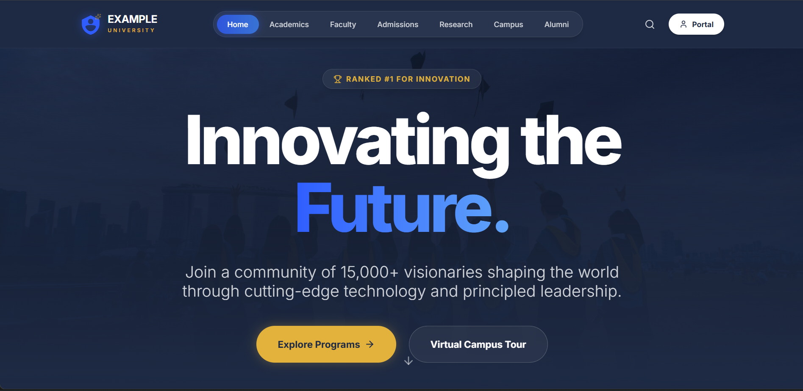
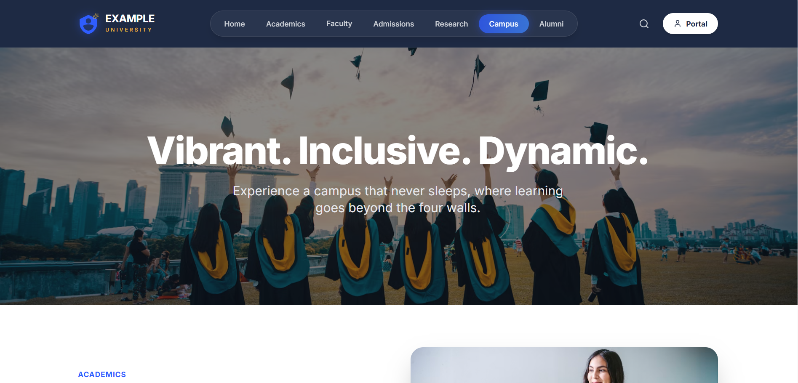
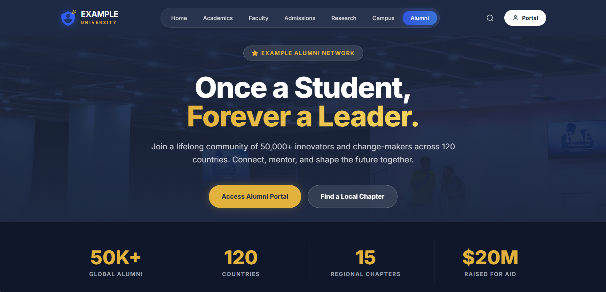
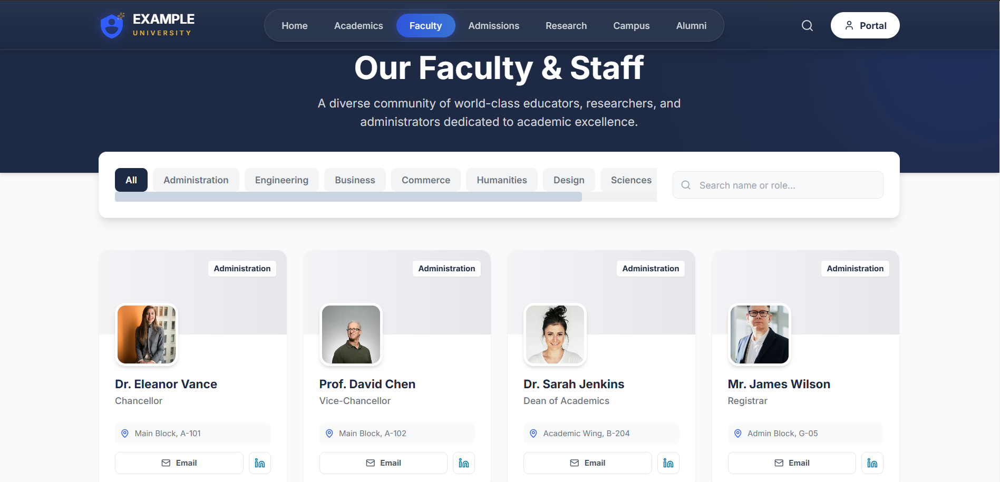

<div align="center">
   <h1>Example University Platform</h1>
   <p><strong>A premium university website + multi-role portals (Student / Faculty / Admin)</strong></p>

   <p>
      <a href="https://exampleuni.netlify.app/">Live Demo</a>
      ·
      <a href="#screenshots">Screenshots</a>
      ·
      <a href="#for-recruiters">For Recruiters</a>
      ·
      <a href="#for-students">For Students</a>
   </p>
</div>

---

## What This Project Demonstrates

This project is built as a **portfolio-grade showcase**—designed to look and feel like a real institutional product.

- Brand-level UI polish (navy + gold visual language, strong typography, motion-first sections)
- Multi-role architecture (public website + student/faculty/admin portals)
- Realistic product flows (program browsing, course detail, schedules, grades, user management)
- Maintainable React patterns (lazy-loaded routes, shared layouts, centralized state via context)

## Live Demo

- https://exampleuni.netlify.app/

Notes:
- Uses **hash routing** (`/#/...`) so it deploys cleanly to static hosting without server rewrites.

## Overview

Example University is a multi-role web experience that pairs a marketing-grade public site with operational portals. It is intentionally built with **clean UX, crisp transitions, and structured UI composition** to mirror production standards.

## Highlights

- Public website with story-driven hero sections and conversion-style CTAs
- Student portal: dashboard, schedule, grades, course details
- Faculty portal: teaching dashboard + classes
- Admin portal: analytics overview + user management
- Route-level code splitting + suspense fallbacks for fast initial load

---

## For Recruiters

If you’re evaluating my work for an internship/full-time role, here’s what you can quickly assess from this codebase.

### Core Skills Showcased

- **React + TypeScript (production-style component design)**
   - Consistent props typing, reusable sections, and separation of concerns.
- **Routing & app structure**
   - HashRouter + route-level lazy loading in [App.tsx](App.tsx).
- **State management & data modeling**
   - Central provider in [context/UniversityContext.tsx](context/UniversityContext.tsx) with typed entities (users, programs, courses, notices).
- **UI/UX engineering**
   - Motion design with `framer-motion`, responsive layouts, and polished interaction states.
- **Dashboard-style visualization**
   - Charts in the admin experience using `recharts`.

### Architecture (High Level)

- **Routing:** public routes + dedicated portal routes.
- **Layout strategy:** common navbar/footer for public pages, portal layout for dashboard screens.
- **Data source:** mocked master data (programs/courses/users) to demonstrate end-to-end flows without requiring a backend.

### Product Thinking / Decisions

- **Static-host friendly:** Hash routing avoids deployment complexity.
- **Performance-minded:** lazy-loaded pages to reduce initial bundle.
- **Realistic UX:** portals are role-oriented and present information in the way users actually consume it (schedule grid, grades table, admin insights).

### If I Had More Time (Roadmap)

- Replace mock data with an API + persistence layer.
- Add authentication tokens + protected route guards.
- Add form validation + server-side error flows.
- Add tests (unit + integration) around core portal flows.

---

## For Students

If you’re learning frontend engineering, this repo is structured to be a readable reference.

### What You Can Learn Here

- How to organize a React app by **pages vs shared components**
- How to build **route-level code splitting** with `React.lazy` + `Suspense`
- How to use **Context** to model domain data (users, courses, notices)
- How to create dashboard-style UIs (tables, cards, charts)
- How to add tasteful **motion** without overwhelming the UI

### Suggested Learning Path

1. Start at [App.tsx](App.tsx) to understand the route map and portal separation.
2. Open [context/UniversityContext.tsx](context/UniversityContext.tsx) to see how the project models data and exposes actions.
3. Explore the portal pages under [pages/portal](pages/portal) to study dashboard composition.

### How To Extend It

- Add a new portal page under `pages/portal/` and register it in [App.tsx](App.tsx).
- Add a new dataset type in [types.ts](types.ts) and wire it into the context provider.

---

## Tech Stack

- React + TypeScript + Vite
- React Router (HashRouter)
- framer-motion
- Recharts
- Lucide icons

## Local Setup

Prerequisite: Node.js (LTS recommended)

```bash
npm install
npm run dev
```

Build & preview:

```bash
npm run build
npm run preview
```

## Project Structure

- [pages](pages) — public site + portal screens
- [components](components) — shared UI building blocks
- [context/UniversityContext.tsx](context/UniversityContext.tsx) — app state + mock data
- [public/images](public/images) — screenshots used below

## Deployment

- Build command: `npm run build`
- Publish directory: `dist`
- Hash routing means no special rewrite rules are required.

## Screenshots

### Public site









### Portals


### Profiles


---

## Developer

This project was conceived, designed, and fully built by **Ram Sharma**.
